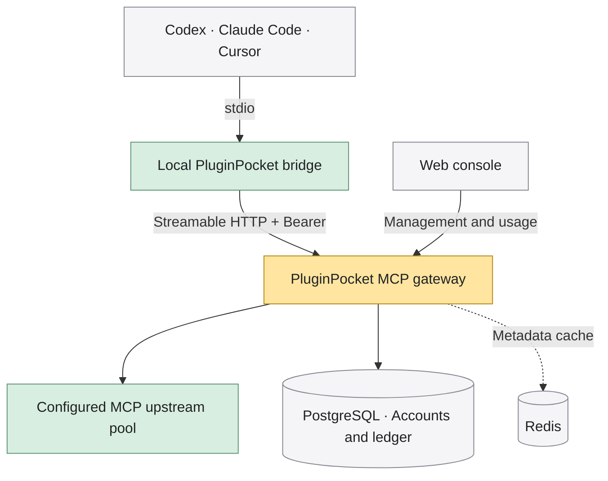

<p align="center">
  
</p>

<h1 align="center">PluginPocket</h1>
<p align="center"><strong>Your AI superpowers, in your pocket.</strong></p>
<p align="center">An open-source, self-hosted MCP gateway and plugin marketplace.<br>Equip Codex, Claude Code, and Cursor with the tools they need.</p>

<p align="center">
  <a href="LICENSE"></a>
  <a href="docs/DEPLOYMENT.md"></a>
  <a href="CONTRIBUTING.md"></a>
</p>

<p align="center"><a href="README.md">简体中文</a> · <strong>English</strong></p>
<p align="center"><a href="#quick-start">Quick start</a> · <a href="#connect-your-ai-clients">Connect your clients</a> · <a href="docs/DEPLOYMENT.md">Deployment</a> · <a href="CONTRIBUTING.md">Contribute</a></p>

---

## Great tools. One toolbox.

Stop repeating MCP server discovery, upstream key management, and configuration across every AI client. PluginPocket brings tool access together: administrators maintain a shared tool pool, users connect through a local bridge, and teams manage configuration, credits, and usage in one place.

**MIT across the repository, built for self-hosting and team autonomy.** Credits and metering help govern resources; core features have no closed-source edition boundary.

| What you need | What PluginPocket provides |
| --- | --- |
| Tools for your favorite AI | A Rust CLI for Codex, Claude Code, and Cursor; default bridge mode keeps tokens out of client configuration |
| A setup worth sharing | HTTP MCP plugins, Agent Skills, bundles, GitHub imports, and curated sync |
| Visibility into every call | Authentication, metering, a transactional credit ledger, and permission-scoped input/output details |
| Shared team resources | Shared credits, membership, tokens, and an administrator console |
| Your own infrastructure | A Go server, React console, PostgreSQL, optional Redis caching, and multiple replicas |
| A comfortable workspace | Chinese and English UI, light and dark themes, responsive layouts, and a Tauri desktop companion |

## From one plugin to a complete kit

<p align="center">
  
</p>

| Item | Contents | How it works |
| --- | --- | --- |
| **MCP plugin** | An HTTP MCP tool service | Add it to the server pool or install a public endpoint as a direct local connection |
| **Agent Skill** | `SKILL.md`, scripts, and attachments | Install into supported client skill directories with SHA256 checks and executable permissions preserved |
| **Bundle** | A collection of MCP plugins and skills | Reproduce a complete setup with one command |

The public catalog at `/plugins` supports search, type filters, and shareable pagination links. Administrators can import GitHub skills, edit files with Markdown previews, and publish bundles.

## Connect your AI clients

If you already have access to a PluginPocket server, install the CLI first. This requires Rust and a local C/C++ build environment; see the toolchain versions below.

```bash
# Run from the repository root; ensure ~/.cargo/bin is on PATH
cargo install --path cli --locked

# Replace the URL with your server and authorize in your browser
pluginpocket login --device --server https://pluginpocket.example.com
pluginpocket apply --clients codex,claude,cursor
```

Restart your AI clients to use the administrator-enabled tools. The [Tauri desktop companion](desktop/README.md) also manages local connections.

**Install from the marketplace:** after login, browse the catalog and replace the example `expert-pack` slug with an actual entry.

```bash
pluginpocket market
pluginpocket install expert-pack
pluginpocket update
pluginpocket uninstall expert-pack
```

`apply` configures the shared gateway. `install` adds direct public MCP connections, skills, or bundles according to the entry type. Direct connections bypass PluginPocket gateway metering.

**Use it as a Codex plugin marketplace:** the server exposes `/marketplace.git` directly. Plugins containing gateway tools still require the PluginPocket CLI and login.

```bash
codex plugin marketplace add https://pluginpocket.example.com/marketplace.git
```

## How it fits together

<p align="center">
  
</p>



- **Centralized credentials:** the bridge reads tokens from private local credentials. Operators manage upstream credentials; PluginPocket does not hold users' private third-party OAuth tokens.
- **Accountable calls:** reservations, settlement, and failure refunds run through transactions with an append-only ledger. Input/output access is permission-scoped and truncated content is marked.
- **Shared state for replicas:** the gateway is stateless; PostgreSQL holds accounts, sessions, and the ledger. Redis cache failures can fall back to upstream discovery.

## Quick start

PluginPocket is a fresh project: it uses the `pluginpocket` command, `PLUGINPOCKET_*` environment variables, and `.pluginpocket/` data directory. Previous configurations are not loaded.

These instructions target Linux / WSL source development. Pinned tools: **Node 26.8.2 · pnpm 12.3.4 · Go 1.27.1 · Rust 1.98.1**. Repository files declare the Go and Rust toolchain versions.

### 1. Get the code and dependencies

```bash
git clone https://github.com/Yanyutin753/PluginPocket.git pluginpocket
cd pluginpocket
npm install -g pnpm@12.3.4
make setup
cp .env.example .env
```

### 2. Configure your environment

Edit `.env` and set at least the following. See the [deployment guide](docs/DEPLOYMENT.md) for details.

- `PLUGINPOCKET_DB_PASSWORD`: generate your own database password and replace `REPLACE_PASSWORD` in both database URLs.
- `PLUGINPOCKET_ENCRYPTION_KEY`: generate with `openssl rand -base64 32` to store encrypted upstream credentials.
- `PLUGINPOCKET_ADMIN_USERNAME` / `PLUGINPOCKET_ADMIN_PASSWORD`: bootstrap the administrator on first startup.

```bash
make db-up
make redis-up
# Create a dedicated test database once for the full harness
docker compose exec db createdb -U pluginpocket pluginpocket_test
make up
```

Open the [local console](http://127.0.0.1:5173) or [public marketplace](http://127.0.0.1:5173/plugins). Vite proxies same-origin API requests to the Go service on port `8787`. Administrators manage the catalog at `/admin/marketplace`.

Root development commands load `.env` automatically; run `make restart` after changing it. **Export environment variables explicitly when running the Go binary or `make check` directly.** Without a database, only infrastructure health checks are available.

### 3. Pick a run mode

| Scenario | Entry point |
| --- | --- |
| Background development | `make up` / `make down` / `make restart` |
| Foreground development with automatic reload | `pnpm run dev` at the repository root; Ctrl+C to stop |
| Status and logs | `make status` / `make logs` |
| Production build | `make build`, then load environment variables and run `./build/pluginpocket-server` |
| Compose self-hosting | Follow [production configuration](docs/DEPLOYMENT.md#容器与生产配置), then run `make docker-up` |
| Cluster deployment | [Multiple replicas and Kubernetes templates](docs/CLUSTER.md) |

<details>
<summary>More development commands and runtime conventions</summary>

| Command | Purpose |
| --- | --- |
| `make help` | List all commands |
| `make ready` | Run the complete checks, then start development services |
| `make test` | Go, Rust, and React tests |
| `make check` | Complete static checks, tests, builds, and real integration flows |
| `make test-product` / `make benchmark` | Real product flows / same-wallet transaction benchmark |
| `make build-desktop` | Build a Linux Tauri deb; requires system development libraries |
| `make docker-down` / `make docker-logs` | Stop containers / read container logs |

The root `package.json` exposes equivalent NPM Scripts for IDE use. Background commands use Unix sockets and process groups; use WSL on Windows. Logs live in `.pluginpocket/`. Do not run background and foreground instances on the same ports. See the deployment guide for custom ports, isolated instances, backups, and recovery.

</details>

## Project status

Accounts and teams, the gateway and credit ledger, marketplace, skill file workspace, administrator console, CLI, and desktop companion are implemented. The application currently requires PostgreSQL. SQLite migrations and a ledger implementation are in progress; SQLite is not yet a replacement database for the complete application.

GitHub login and email require operator configuration. External payments are not integrated. Desktop release workflows target Windows, macOS, and Linux; see [desktop release notes](desktop/README.md#桌面发行) for package availability, signing, and platform validation boundaries. The [product plan](docs/PLAN.md) and [development harness](docs/HARNESS.md) track implementation and verification evidence.

## Documentation and contributions

Issues, documentation improvements, shared skills and bundles, and code contributions are welcome. Start with [CONTRIBUTING.md](CONTRIBUTING.md).

This README is available in English; the detailed engineering and deployment documents linked below are currently maintained in Chinese.

| Guide | Contents |
| --- | --- |
| [Deployment](docs/DEPLOYMENT.md) · [Environment variables](docs/ENVIRONMENT.md) | Local development and self-hosting |
| [Clusters](docs/CLUSTER.md) · [File storage](docs/FILE_STORAGE.md) | Replicas, shared databases, and S3 attachments |
| [Product plan](docs/PLAN.md) · [Architecture decisions](docs/adr/) | Scope and design tradeoffs |
| [Development harness](docs/HARNESS.md) · [Demo guide](docs/DEMO.md) | Tests, real product flows, and demo data |
| [Frontend guidelines](docs/FRONTEND.md) · [Design system](DESIGN.md) | Components, accessibility, and workshop visuals |
| [Development contract](AGENTS.md) | TDD, engineering boundaries, and documentation obligations |

Behavior changes follow RED → GREEN → REFACTOR. Run `make check` before submitting changes. It requires dedicated PostgreSQL / Redis test connections and Linux desktop dependencies; report any checks you could not run in your PR.

## License

[MIT](LICENSE) © PluginPocket contributors. Bundled third-party fonts and components retain their respective licenses.

<p align="center"><sub>Made for your next great idea.</sub></p>
