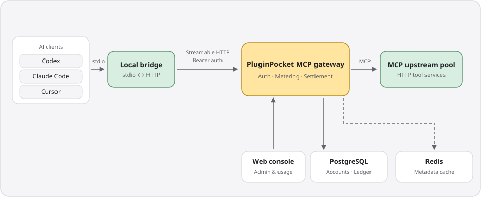

<p align="center">
  
</p>

<h1 align="center">PluginPocket</h1>

<p align="center"><strong>Your AI superpowers, in your pocket.<br>把 AI 的超能力，装进口袋。</strong></p>

<p align="center">An open-source, self-hosted MCP gateway and plugin marketplace.<br>Equip Codex, Claude Code, and Cursor with the tools they need.</p>

<p align="center">
  <a href="LICENSE"></a>
  <a href="docs/DEPLOYMENT.md"></a>
  <a href="CONTRIBUTING.md"></a>
</p>

<p align="center"><a href="README.md">简体中文</a> · <strong>English</strong></p>
<p align="center"><a href="#quick-start">Quick start</a> · <a href="#how-it-fits-together">Architecture</a> · <a href="#project-status">Status</a> · <a href="#documentation-and-contributing">Docs</a></p>

---

## Great tools. One toolbox.

Stop repeating MCP server discovery, upstream key management, and hand-edited configuration in every AI client. PluginPocket gathers tool access into one pocket: administrators maintain a shared tool pool, members connect after login, and teams manage configuration, credits, and usage in one place. MIT across the repository, with no closed-source edition boundary.

<p align="center">
  
</p>

- 🔌 **Configure once, connect every client** — a Rust CLI sets up Codex, Claude Code, and Cursor with one `apply`; default bridge mode keeps tokens out of client configuration.
- 🧰 **A marketplace worth copying** — three kinds of gear: HTTP MCP plugins, Agent Skills, and bundles combining both; GitHub imports and curated sync, with `pluginpocket install` reproducing a complete setup.
- 📊 **Every call accounted for** — unified authentication and metering; reserve, settle, refund run through a transactional ledger with automatic failure refunds, plus permission-scoped input/output details.
- 🏠 **Self-hosted, team-governed** — a Go server, React console, and PostgreSQL; shared team credits, member and token management, an admin console, and a Tauri desktop companion.

## Quick start

The flow below targets Linux / WSL source development and walks the full chain in three steps. Pinned tools: **Node 26.8.2 · pnpm 12.3.4 · Go 1.27.1 · Rust 1.98.1** (repository files declare the Go and Rust toolchains).

### 1. Start the server

```bash
git clone https://github.com/Yanyutin753/PluginPocket.git pluginpocket
cd pluginpocket
npm install -g pnpm@12.3.4
make setup
cp .env.example .env
```

Edit `.env` and set at least the following (see the [deployment guide](docs/DEPLOYMENT.md)):

- `PLUGINPOCKET_DB_PASSWORD` — your own database password, replacing `REPLACE_PASSWORD` in both database URLs
- `PLUGINPOCKET_ENCRYPTION_KEY` — generate with `openssl rand -base64 32`; stores encrypted upstream credentials
- `PLUGINPOCKET_ADMIN_USERNAME` / `PLUGINPOCKET_ADMIN_PASSWORD` — bootstrap the administrator on first startup

```bash
make db-up
make redis-up
make up
```

Open the [local console](http://127.0.0.1:5173) or the [public marketplace](http://127.0.0.1:5173/plugins); administrators manage catalog content at `/admin/marketplace`.

### 2. Connect your AI clients

Requires a local Rust and C/C++ build environment.

```bash
# Install the CLI from the repository root; ensure ~/.cargo/bin is on PATH
cargo install --path cli --locked

# Replace the URL with your server and authorize in your browser
pluginpocket login --device --server https://pluginpocket.example.com
pluginpocket apply --clients codex,claude,cursor
```

Restart your clients to use the administrator-enabled tools. The [Tauri desktop companion](desktop/README.md) manages local connections through Overview, My Equipment, Operation Logs, and Connection Diagnostics.

### 3. Install from the marketplace

<p align="center">
  
</p>

```bash
pluginpocket market                # browse the catalog (web view at /plugins)
pluginpocket install expert-pack   # replace with an actual entry slug
pluginpocket update
pluginpocket uninstall expert-pack
```

`apply` configures the shared gateway; `install` adds public MCP direct connections, skills, or bundles by type (direct connections bypass gateway metering). The server also serves as a Codex plugin marketplace source; plugins with gateway tools still require the CLI and login:

```bash
codex plugin marketplace add https://pluginpocket.example.com/marketplace.git
```

Daily commands: `make up / down / restart / status / logs` (run `make restart` after `.env` changes), `pnpm run dev` at the root for foreground auto-reload, and `make help` for everything else. See the [deployment guide](docs/DEPLOYMENT.md) for production, clusters, and backups; export environment variables explicitly when running the Go binary or `make check` directly.

## How it fits together

<p align="center">
  
</p>

- 🔐 **Centralized credentials** — the bridge reads tokens from private local credentials; operators host upstream credentials, and PluginPocket never holds users' private third-party OAuth tokens.
- 🧾 **Accountable calls** — reservations, settlement, and failure refunds run through transactions with an append-only ledger; truncated content is marked.
- 📈 **Scales out** — the gateway is stateless; PostgreSQL holds accounts, sessions, and the ledger, and Redis cache failures can fall back to upstream discovery.

## Project status

Accounts and teams, the gateway and credit ledger, marketplace, skill file workspace, admin console, CLI, and desktop companion are implemented. The application currently requires PostgreSQL; the SQLite track is in progress and not yet a replacement database. GitHub login and email require operator configuration, and external payments are not integrated. See the [desktop release notes](desktop/README.md#桌面发行) for packaging, signing, and platform validation boundaries, and the [product plan](docs/PLAN.md) and [development harness](docs/HARNESS.md) for full progress and verification evidence.

## Documentation and contributing

Issues, documentation improvements, shared skills and bundles, and code contributions are welcome — start with the [contributing guide](CONTRIBUTING.md). Behavior changes follow RED → GREEN → REFACTOR; run `make check` before submitting (it needs dedicated PostgreSQL / Redis test connections and Linux desktop dependencies — report any checks you could not run in your PR).

| Guide | Contents |
| --- | --- |
| [Deployment](docs/DEPLOYMENT.md) · [Environment](docs/ENVIRONMENT.md) · [Clusters](docs/CLUSTER.md) | Local development to self-hosting |
| [Product plan](docs/PLAN.md) · [ADR index](docs/adr/) | Scope and design tradeoffs |
| [Development harness](docs/HARNESS.md) · [Demo guide](docs/DEMO.md) | Tests, real flows, and demo data |
| [Frontend guidelines](docs/FRONTEND.md) · [Design system](DESIGN.md) · [File storage](docs/FILE_STORAGE.md) | Components, accessibility, and visuals |
| [Development contract](AGENTS.md) | TDD, engineering boundaries, doc sync |

The READMEs are bilingual; the detailed engineering and deployment documents linked above are currently maintained in Chinese.

## License

[MIT](LICENSE) © PluginPocket contributors. Bundled third-party fonts and components retain their respective licenses.

<p align="center">
  <br>
  <sub>Made for your next great idea.</sub>
</p>
