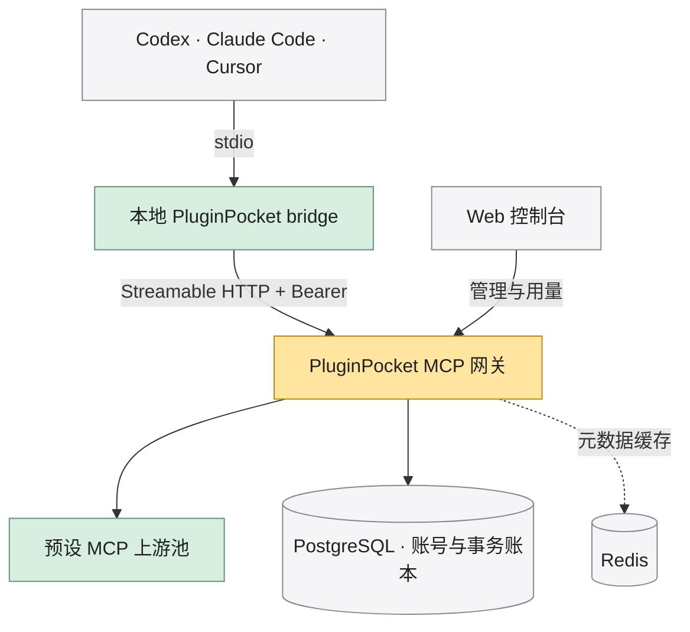

<p align="center">
  
</p>

<h1 align="center">PluginPocket · 插件口袋</h1>
<p align="center"><strong>把 AI 的超能力，装进口袋。</strong><br>Your AI superpowers, in your pocket.</p>
<p align="center">开源、自托管的 MCP 装备网关与插件市场。<br>让 Codex、Claude Code、Cursor 带着合适的工具开始工作。</p>

<p align="center">
  <a href="LICENSE"></a>
  <a href="docs/DEPLOYMENT.md"></a>
  <a href="CONTRIBUTING.md"></a>
</p>

<p align="center"><strong>简体中文</strong> · <a href="README.en.md">English</a></p>
<p align="center"><a href="#快速开始">快速开始</a> · <a href="#连接你的-ai-客户端">客户端接入</a> · <a href="docs/DEPLOYMENT.md">部署文档</a> · <a href="CONTRIBUTING.md">参与贡献</a></p>

---

## 好工具，装进同一个工具箱

不必为每个 AI 客户端重复寻找 MCP server、管理上游密钥、手改配置。PluginPocket 将工具入口集中起来：管理员维护预设工具池，使用者登录后通过本地 bridge 接入，团队在一个地方管理配置、额度与用量。

**全仓库 MIT，面向个人自部署与团队自治理。** 额度和计量用于管理资源，核心功能没有闭源版本边界。

| 你想做什么 | PluginPocket 提供什么 |
| --- | --- |
| 给熟悉的 AI 配上工具 | Rust CLI 一次配置 Codex、Claude Code、Cursor；默认 bridge 不把令牌写入客户端配置 |
| 发现并分享一套好配置 | HTTP MCP 插件、Agent Skill、装备组；GitHub 导入与精选同步 |
| 看清每一次调用 | 统一鉴权、计量、事务额度账本；用量详情按权限展示输入与输出 |
| 和团队共用工具 | 团队共享额度、成员管理、令牌与管理员控制台 |
| 在自己的环境运行 | Go 服务端、React 控制台、PostgreSQL；Redis 共享缓存与多副本支持 |
| 舒服地管理日常工作 | 中英文、浅色与深色主题、响应式布局，以及 Tauri 桌面接入端 |

## 从一个插件，到一整套装备

<p align="center">
  
</p>

| 装备 | 内容 | 使用方式 |
| --- | --- | --- |
| **MCP 插件** | HTTP MCP 工具服务 | 加入服务端工具池，或将公共端点安装为本地直连 |
| **Agent Skill** | `SKILL.md`、脚本与附件 | 安装到支持的客户端技能目录，校验 SHA256 并保留执行权限 |
| **装备组** | MCP 插件与技能的组合 | 一条命令复刻一整套配置 |

公共目录位于 `/plugins`，支持搜索、类型筛选与可分享的分页链接。管理员可导入 GitHub 技能、编辑文件与预览 Markdown，再组合成装备组发布。

## 连接你的 AI 客户端

已有可用的 PluginPocket 服务时，先安装 CLI。需要本机 Rust 与 C/C++ 编译环境，版本见下方快速开始。

```bash
# 在仓库根目录安装，确保 ~/.cargo/bin 在 PATH 中
cargo install --path cli --locked

# 将地址替换为你的服务地址，在浏览器中完成设备授权
pluginpocket login --device --server https://pluginpocket.example.com
pluginpocket apply --clients codex,claude,cursor
```

重启对应 AI 客户端，即可使用管理员已启用的工具。也可以使用 [Tauri 桌面端](desktop/README.md) 管理本地接入。

**从市场安装：** 登录后浏览目录，将示例标识 `expert-pack` 替换为实际条目的 slug。

```bash
pluginpocket market
pluginpocket install expert-pack
pluginpocket update
pluginpocket uninstall expert-pack
```

`apply` 配置统一网关；`install` 按条目类型安装公共 MCP 直连配置、技能或装备组。本地直连调用不经过 PluginPocket 网关计量。

**作为 Codex 插件市场源：** 服务端直接提供 `/marketplace.git`，也可通过以下方式接入。含网关工具的插件仍需安装 PluginPocket CLI 并登录。

```bash
codex plugin marketplace add https://pluginpocket.example.com/marketplace.git
```

## 架构一览

<p align="center">
  
</p>



- **密钥集中管理**：bridge 从本地私有凭据中读取令牌；上游凭证由部署者托管，不接管用户私人第三方 OAuth token。
- **调用有据可查**：预留、结算、失败退款通过事务执行，账本只追加；输入输出按权限读取，超限内容标注截断。
- **共享状态支持扩展**：网关无状态，账号、会话与账本保存在 PostgreSQL；Redis 缓存故障时可降级。

## 快速开始

PluginPocket 按全新项目运行，使用 `pluginpocket` 命令、`PLUGINPOCKET_*` 环境变量与 `.pluginpocket/` 数据目录；不读取旧版配置。

以下为 Linux / WSL 源码开发流程。工具链固定为 **Node 26.8.2 · pnpm 12.3.4 · Go 1.27.1 · Rust 1.98.1**；Go / Rust 工具链版本由仓库文件声明。

### 1. 获取代码与依赖

```bash
git clone https://github.com/Yanyutin753/PluginPocket.git pluginpocket
cd pluginpocket
npm install -g pnpm@12.3.4
make setup
cp .env.example .env
```

### 2. 配置自己的环境

编辑 `.env`，至少完成以下配置，详见 [部署说明](docs/DEPLOYMENT.md)：

- `PLUGINPOCKET_DB_PASSWORD`：自行生成数据库密码，并替换两个数据库 URL 中的 `REPLACE_PASSWORD`。
- `PLUGINPOCKET_ENCRYPTION_KEY`：使用 `openssl rand -base64 32` 生成，用于保存加密上游凭证。
- `PLUGINPOCKET_ADMIN_USERNAME` / `PLUGINPOCKET_ADMIN_PASSWORD`：首次启动时创建管理员。

```bash
make db-up
make redis-up
# 首次为完整检查创建独立测试库
docker compose exec db createdb -U pluginpocket pluginpocket_test
make up
```

打开 [本地控制台](http://127.0.0.1:5173) 或 [公共插件市场](http://127.0.0.1:5173/plugins)。Vite 将同源 API 请求转发到 Go 服务的 `8787` 端口；管理员可在 `/admin/marketplace` 管理市场内容。

根目录开发命令自动读取 `.env`，修改后执行 `make restart`。**单独运行 Go 二进制或 `make check` 需要显式导出环境变量。** 不配置数据库时仅提供健康检查，账号与工具业务不可用。

### 3. 选择运行方式

| 场景 | 入口 |
| --- | --- |
| 后台开发 | `make up` / `make down` / `make restart` |
| 前台开发与自动重载 | 根目录 `pnpm run dev`，Ctrl+C 停止 |
| 查看运行状态和日志 | `make status` / `make logs` |
| 生产构建 | `make build`，加载环境变量后运行 `./build/pluginpocket-server` |
| Compose 自托管 | 按 [生产配置](docs/DEPLOYMENT.md#容器与生产配置) 设置后运行 `make docker-up` |
| 集群部署 | [多副本与 Kubernetes 模板](docs/CLUSTER.md) |

<details>
<summary>更多开发命令与运行约定</summary>

| 命令 | 用途 |
| --- | --- |
| `make help` | 全部命令入口 |
| `make ready` | 完整检查成功后启动开发服务 |
| `make test` | Go、Rust 与 React 测试 |
| `make check` | 完整静态检查、测试、构建与真实集成流程 |
| `make test-product` / `make benchmark` | 真实产品链路 / 同钱包事务基准 |
| `make build-desktop` | 构建 Linux Tauri deb，需系统开发库 |
| `make docker-down` / `make docker-logs` | 停止容器 / 查看容器日志 |

根 `package.json` 提供对应 NPM Scripts，方便在 IDE 中运行。后台管理命令使用 Unix socket 和进程组，Windows 请用 WSL；日志保存在 `.pluginpocket/`。不要同时启动占用相同端口的后台和前台实例。自定义端口、隔离实例、备份和恢复见部署文档。

</details>

## 项目状态

账号与团队、网关与额度账本、插件市场、技能文件工作区、管理后台、CLI 和桌面端均已实现。当前应用运行依赖 PostgreSQL；SQLite 正在推进独立迁移与账本轨道，尚不能作为完整应用的替代数据库。

GitHub 登录与邮件需自行配置；外部支付尚未接入。桌面发行已配置 Windows、macOS 与 Linux 构建流程，实际包、签名及平台验收范围以 [桌面发行说明](desktop/README.md#桌面发行) 为准。完整进度与验证证据见 [产品计划](docs/PLAN.md) 和 [开发 Harness](docs/HARNESS.md)。

## 文档与贡献

欢迎提交问题、改进文档、分享技能与装备组，或参与代码贡献。开始前请阅读 [贡献指南](CONTRIBUTING.md)。

| 文档 | 内容 |
| --- | --- |
| [部署说明](docs/DEPLOYMENT.md) · [环境变量](docs/ENVIRONMENT.md) | 从本地运行到自托管 |
| [集群部署](docs/CLUSTER.md) · [文件存储](docs/FILE_STORAGE.md) | 多副本、共享数据库与 S3 附件 |
| [产品计划](docs/PLAN.md) · [架构决策](docs/adr/) | 能力范围与设计取舍 |
| [开发 Harness](docs/HARNESS.md) · [演示说明](docs/DEMO.md) | 测试、真实链路与演示数据 |
| [前端规范](docs/FRONTEND.md) · [设计系统](DESIGN.md) | 组件、无障碍与 AI 装备工坊视觉 |
| [开发契约](AGENTS.md) | TDD、工程边界与文档同步要求 |

行为变更遵循 RED → GREEN → REFACTOR，提交前运行 `make check`。完整检查需要独立 PostgreSQL / Redis 测试连接及 Linux 桌面依赖；未执行的检查请在 PR 中说明。

## License

[MIT](LICENSE) © PluginPocket contributors。随仓库分发的第三方字体与组件保留各自许可。

<p align="center"><sub>Made for your next great idea.</sub></p>
