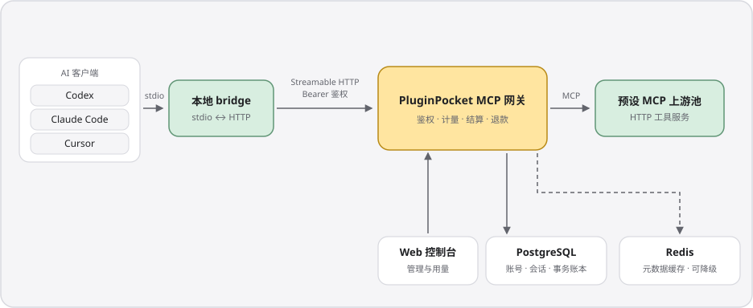

<p align="center">
  
</p>

<h1 align="center">PluginPocket · 插件口袋</h1>

<p align="center"><strong>把 AI 的超能力，装进口袋。<br>Your AI superpowers, in your pocket.</strong></p>

<p align="center">开源、可自托管的 MCP 网关与插件市场，<br>让 Codex、Claude Code、Cursor 带着合适的工具开工。</p>

<p align="center">
  <a href="LICENSE"></a>
  <a href="docs/DEPLOYMENT.md"></a>
  <a href="CONTRIBUTING.md"></a>
</p>

<p align="center"><strong>简体中文</strong> · <a href="README.en.md">English</a></p>
<p align="center"><a href="#快速开始">快速开始</a> · <a href="#架构一览">架构</a> · <a href="#项目状态">状态</a> · <a href="#文档与贡献">文档</a></p>

---

## 好工具，装进同一个工具箱

不必在每个 AI 客户端里重复找 MCP server、管上游密钥、手改配置。PluginPocket 把工具入口集中到一个口袋里：管理员维护预设工具池，成员登录即用，团队在同一个地方管理配置、额度与用量。全仓库 MIT，没有闭源版本边界。

<p align="center">
  
</p>

- 🔌 **一次配置，接入所有客户端** —— Rust CLI 一条 `apply` 配好 Codex、Claude Code、Cursor；默认 bridge 模式不把令牌写进客户端配置。
- 🧰 **插件市场，一键复刻** —— 三类装备：HTTP MCP 插件、Agent Skill、装备组（组合前两者）；支持 GitHub 导入与精选同步，`pluginpocket install` 复刻一整套配置。
- 📊 **每一次调用有据可查** —— 统一鉴权与计量，预留-结算-退款走事务账本、失败自动退款；用量详情按权限展示输入与输出。
- 🏠 **自托管，团队自治** —— Go 服务端 + React 控制台 + PostgreSQL；团队共享额度、成员与令牌管理、管理后台和 Tauri 桌面端齐备。

## 快速开始

以 Linux / WSL 源码开发为例，三步跑通完整链路。工具链固定为 **Node 26.8.2 · pnpm 12.3.4 · Go 1.27.1 · Rust 1.98.1**（Go / Rust 版本由仓库文件声明）。

### 1. 启动服务

```bash
git clone https://github.com/Yanyutin753/PluginPocket.git pluginpocket
cd pluginpocket
npm install -g pnpm@12.3.4
make setup
cp .env.example .env
```

编辑 `.env`，至少设置以下三项（详见[部署说明](docs/DEPLOYMENT.md)）：

- `PLUGINPOCKET_DB_PASSWORD` —— 自行生成的数据库密码，替换两个数据库 URL 中的 `REPLACE_PASSWORD`
- `PLUGINPOCKET_ENCRYPTION_KEY` —— 用 `openssl rand -base64 32` 生成，用于加密上游凭证
- `PLUGINPOCKET_ADMIN_USERNAME` / `PLUGINPOCKET_ADMIN_PASSWORD` —— 首次启动时创建管理员

```bash
make db-up
make redis-up
make up
```

打开[本地控制台](http://127.0.0.1:5173)或[公共插件市场](http://127.0.0.1:5173/plugins)即可使用；管理员在 `/admin/marketplace` 管理市场内容。

### 2. 接入 AI 客户端

需要本机 Rust 与 C/C++ 编译环境。

```bash
# 在仓库根目录安装 CLI，确保 ~/.cargo/bin 在 PATH 中
cargo install --path cli --locked

# 地址换成你的服务地址，在浏览器中完成设备授权
pluginpocket login --device --server https://pluginpocket.example.com
pluginpocket apply --clients codex,claude,cursor
```

重启对应客户端，即可使用管理员已启用的工具；也可以用 [Tauri 桌面端](desktop/README.md) 的概览、我的装备、运行日志与连接诊断管理本地接入。

### 3. 安装市场装备

<p align="center">
  
</p>

```bash
pluginpocket market                # 浏览目录（网页在 /plugins）
pluginpocket install expert-pack   # 换成实际条目的 slug
pluginpocket update
pluginpocket uninstall expert-pack
```

`apply` 接统一网关；`install` 按类型安装公共 MCP 直连、技能或装备组（本地直连不经过网关计量）。服务端同时直接提供 Codex 插件市场源，含网关工具的插件仍需 CLI 登录：

```bash
codex plugin marketplace add https://pluginpocket.example.com/marketplace.git
```

日常命令：`make up / down / restart / status / logs`（`.env` 改动后执行 `make restart`），前台自动重载用根目录 `pnpm run dev`，全部命令见 `make help`。生产部署、集群与备份见[部署说明](docs/DEPLOYMENT.md)；单独运行 Go 二进制或 `make check` 需显式导出环境变量。

## 架构一览

<p align="center">
  
</p>

- 🔐 **密钥集中** —— bridge 从本地私有凭据读取令牌；上游凭证由部署者托管，不接管用户私人第三方 OAuth token。
- 🧾 **调用有账** —— 预留、结算、失败退款全部走事务，账本只追加；超限内容标注截断。
- 📈 **可扩展** —— 网关无状态，账号、会话与账本保存在 PostgreSQL；Redis 缓存故障可降级。

## 项目状态

账号与团队、网关与额度账本、插件市场、技能文件工作区、管理后台、CLI 与桌面端均已实现；桌面端 v0.3.0 起内置自动更新（Minisign 验签后一键安装重启）。当前运行依赖 PostgreSQL，SQLite 独立轨道推进中，暂不能作为替代数据库。GitHub 登录与邮件需自行配置，外部支付尚未接入；桌面发行范围以[桌面发行说明](desktop/README.md#桌面发行)为准。完整进度与验证证据见[产品计划](docs/PLAN.md)与[开发 Harness](docs/HARNESS.md)。

## 文档与贡献

欢迎提交 issue、改进文档、分享技能与装备组或贡献代码，开始前请读[贡献指南](CONTRIBUTING.md)。行为变更遵循 RED → GREEN → REFACTOR，提交前运行 `make check`（需要独立 PostgreSQL / Redis 测试连接与 Linux 桌面依赖，未能执行的检查请在 PR 中说明）。

| 文档 | 内容 |
| --- | --- |
| [部署说明](docs/DEPLOYMENT.md) · [环境变量](docs/ENVIRONMENT.md) · [集群](docs/CLUSTER.md) | 从本地运行到自托管 |
| [产品计划](docs/PLAN.md) · [架构决策](docs/adr/) | 能力范围与设计取舍 |
| [开发 Harness](docs/HARNESS.md) · [演示说明](docs/DEMO.md) | 测试、真实链路与演示数据 |
| [前端规范](docs/FRONTEND.md) · [设计系统](DESIGN.md) · [文件存储](docs/FILE_STORAGE.md) | 组件、无障碍与视觉 |
| [开发契约](AGENTS.md) | TDD、工程边界与文档同步 |

## License

[MIT](LICENSE) © PluginPocket contributors。随仓库分发的第三方字体与组件保留各自许可。

<p align="center">
  <br>
  <sub>好工具，都装进口袋。</sub>
</p>
