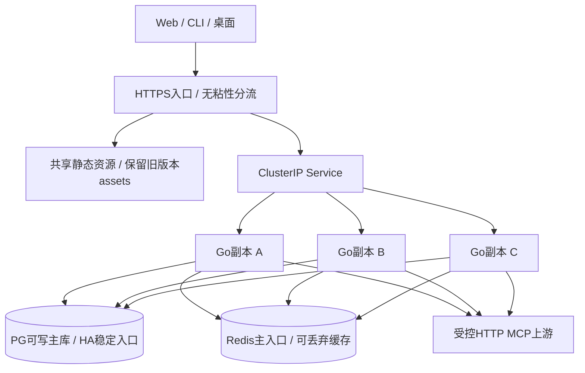

# 集群部署规范

本规范面向Loadout生产应用层，沿用无粘性Go副本、PostgreSQL权威状态和Redis工具目录缓存。提供 [Kubernetes应用模板](../deploy/kubernetes/loadout.yaml) 与 [完整运行时环境示例](../deploy/kubernetes/runtime.env.example)；本地开发仍按 [DEPLOYMENT](DEPLOYMENT.md)。全部变量、缺省值与固定预算见 [ENVIRONMENT](ENVIRONMENT.md)。

模板使用Kubernetes 1.37 API作为验证基线，采用稳定的apps/v1、v1、policy/v1 API及kubelet原生preStop sleep。生产选用平台仍支持并打过安全补丁的版本，先在目标API server做dry-run；不安装控制平面或捆绑第三方Operator。

## 1. 拓扑与责任



- 应用运行至少3副本，部署在至少3个工作节点；需要可用区容灾时，平台再提供跨区调度策略及剩余区容量。模板按hostname分散，不自动保证跨区。
- 所有副本使用同一DB库/schema、Redis namespace、公开Origin、上游加密密钥和身份/赠额策略。令牌、会话、账本、设备授权、兑换、团队和业务限流由PG共享；无session affinity，不使用共享本机凭证目录。
- PostgreSQL由平台提供备份、监控、主库选举、防双主及稳定写入口。资金/授权/撤销/revision不得读取异步副本。RPO/RTO由数据库同步策略与演练决定，不从Go副本数推断。
- Redis可用托管主入口或外部HA服务；应用只连接一个redis/rediss端点，不支持Cluster分片发现或Sentinel自动选主。切换到新主入口后客户端可重新连接；缓存内容丢失可重建。
- 模板仅创建Deployment、Service、PDB。命名空间、镜像仓库权限、Secret、TLS入口、DNS、网络策略、监控和PG/Redis HA由部署环境提供；现有本地compose不是生产集群。

## 2. 流量、静态资源与网络

公开入口统一为一个HTTPS Origin，例如`https://loadout.example.com`；Web、`/api/v1`、`/mcp`及外部身份回调保持此Origin，不增加路径前缀。入口保留Host、Origin、Cookie和Authorization，支持流式响应；`/mcp`禁用响应缓冲，禁止自动重试POST或任何工具执行请求。入口HTTP超时至少覆盖应用40秒写预算，可从60秒起按实测调整。

`/metrics`只对监控网络开放，不通过公网路径透传；`/healthz`和`/readyz`供平台探针。API鉴权结果不被CDN缓存。入口不能将数据库失败的503替换成SPA HTML，也不能把Redis degraded当成整站故障。

**滚动版本必须先处理静态资源兼容。** 当前每个Go镜像只携带自己的Web构建；旧HTML请求的hash资源如果落到另一版本副本，可能404。正式滚动前将新旧`/assets/`发布到同一静态存储/CDN并保留旧hash资源，再更新HTML/API；HTML使用重新验证策略，带hash资产可长期缓存，`/images/`等非hash文件不能盲目永久缓存。未提供共享静态资源时，只能滚动相同Web构建的后端兼容版本，或安排维护窗口同步切换；不能承诺任意版本混跑时前端零中断。

平台网络策略按真实地址实施：

| 路径 | 允许范围 |
| --- | --- |
| 入站8787 | HTTPS入口和监控组件；探针路径按CNI/kubelet实现放行 |
| PG出站 | 指定写入口及其故障切换地址，通常5432/TLS |
| Redis出站 | 指定主入口，通常6379/TLS |
| DNS | 平台DNS的UDP/TCP53 |
| HTTP上游 / GitHub | 必要的HTTPS目标，通常443；不开放任意内网横向访问 |
| SMTP | 已配置的STARTTLS服务器及端口，通常587 |

服务无需Kubernetes API权限，模板禁用ServiceAccount令牌挂载，使用UID65532、只读根文件系统、禁止提权、移除capabilities和RuntimeDefault seccomp。默认镜像没有Shell或stdio程序；需要stdio时单独构建受限运行时并确保每副本一致，有共享状态的工具优先独立为HTTP上游。

## 3. 配置与首次上线

先在本地检查目标上下文，以下命令供部署者执行；准备文件时不访问或修改集群：

```sh
mkdir -p .loadout/cluster
chmod 700 .loadout/cluster
cp deploy/kubernetes/runtime.env.example .loadout/cluster/runtime.env
chmod 600 .loadout/cluster/runtime.env
cp deploy/kubernetes/loadout.yaml .loadout/cluster/loadout.yaml
```

编辑runtime.env中的Origin、DB/Redis主入口、namespace和32字节Base64密钥。需要自动创建首个管理员时同时填用户名及至少12字符密码；不填则不会创建管理员。不要用Shell引号包裹值，特别是JSON白名单；kubectl env-file解析规则见环境参考。编辑loadout.yaml镜像为自己构建并推送的不可变摘要`registry.example.com/team/loadout@sha256:实际摘要`，私有仓库另配imagePullSecrets；样例占位符不能用于上线。

数据库账号需能在指定schema内执行嵌入式迁移，不能仅授予DML却期待自动迁移成功；不要求数据库超级用户。PG TLS必须验证服务名及可信CA；Redis配置rediss与ACL凭据。自签CA作为只读文件挂载，避免关闭证书验证。初始赠额在生产示例中设0，按实际业务策略调整。

准备就绪后，在确认过的目标集群依次执行：

```sh
kubectl config current-context
kubectl create namespace loadout --dry-run=client -o yaml | kubectl apply -f -
# 只把应用20个运行时变量送入Secret；不包含测试URL或本机CLI凭证。
kubectl -n loadout create secret generic loadout-runtime \
  --from-env-file=.loadout/cluster/runtime.env --dry-run=client -o yaml | kubectl apply -f -
# Dry-run验证当前集群API、准入策略与资源配额；不会创建工作负载。
kubectl apply --dry-run=server -f .loadout/cluster/loadout.yaml
kubectl apply -f .loadout/cluster/loadout.yaml
kubectl -n loadout rollout status deployment/loadout --timeout=10m
kubectl -n loadout get pods -l app.kubernetes.io/name=loadout -o wide
kubectl -n loadout get endpointslices -l kubernetes.io/service-name=loadout
kubectl -n loadout get pdb loadout
```

这些命令不输出Secret值，但部署流水线仍应禁用会展开凭据的调试日志；启用平台Secret静态加密和最小RBAC。首次迁移在PG advisory lock与事务内执行，各副本可并发启动；Open/迁移总预算15秒，长DDL需预先在恢复出的同规模测试库评估锁等待和耗时。增加startupProbe次数不会扩大应用内部迁移预算，迁移失败不能用探针掩盖。

为现有入口配置到Service `loadout.loadout.svc:8787`的路由、TLS和前节规则，再验证公开Origin登录、设备授权、目录、无副作用工具调用、用量与账本。初始化完成后可移除两个ADMIN引导变量，按第6节更新Secret；该操作不删除管理员，也不重设其密码。

## 4. 容量、探针与副本数

模板资源requests为250m CPU/256Mi内存，limits为2 CPU/1Gi；这些是待压测的起始配置，不是吞吐保证。密码运算本机并发4，scrypt有显著内存开销；按实际注册/登录与MCP负载观察CPU throttling、RSS、延迟与OOM再调整。

| 项目 | 预算与扩容规则 |
| --- | --- |
| PG连接 | 每副本20；3副本滚动maxSurge1时至少按4×20=80计算，并留运维/其他服务余量。终止中的Pod也可能暂时持有连接，不能把surge当作绝对连接总上限 |
| Redis连接 | 每副本最多8命令连接+1订阅；滚动、旧Pod关闭和监控同样占预算 |
| 上游并发 | 每副本每provider32；扩容会增加总外部并发，需在供应商侧或共享入口另设配额，不能误当成集群32 |
| 业务预算 | token/user及入口限流使用PG原子共享计数，扩容不重置配额 |
| startup/liveness | `/healthz`；不因PG/Redis短暂故障反复重启全部副本 |
| readiness | `/readyz`：PG失败503，Redis不可用仍200并标记degraded；模板超时2秒大于内部1秒探测预算 |

手动扩容例如`kubectl -n loadout scale deployment/loadout --replicas=5`，验证负载分布与数据库连接后再决定保留。缩容底线3，模板PDB minAvailable=2；若主动改变底线，必须同步审核PDB。希望长期保留的副本数还需写回部署源，避免下次apply恢复3。

可在取得真实负载数据、部署Metrics Server后增加autoscaling/v2 HPA，minReplicas至少3；maxReplicas必须受PG连接预算和外部工具并发限制。不要同时用手动replicas和HPA争抢控制权。当前不附带未经压测的HPA阈值或宣称自动扩容已经启用。

## 5. 摘流、滚动升级与回滚

当前Go服务的HTTP写预算40秒，上游执行默认30秒、结算5秒；收到SIGTERM后`http.Server.Shutdown`只等5秒。模板因此使用**kubelet执行的preStop sleep 45秒**：Pod进入终止并从常规就绪端点摘除后，留时间让入口完成路由传播和已接收请求结束，再发送TERM；总terminationGracePeriodSeconds=70涵盖hook、应用关闭和资源释放。scratch镜像没有`/bin/sh`或`sleep`，不要替换为exec shell命令。

preStop期间进程仍在运行，它不是应用级拒绝新请求的drain API。必须演练实际入口对终止端点和已有连接的处理，测量传播耗时；若摘流后仍有新流量到达，修复入口摘流/连接策略或按实测调整preStop，不能只调Pod总grace就声称应用能优雅等待70秒。强制删除、OOM、节点突然断电不经过完整摘流，客户端可能收到失败；未知副作用调用禁止自动重试。Hook和grace的顺序依据 [Kubernetes生命周期规范](https://kubernetes.io/docs/concepts/containers/container-lifecycle-hooks/)。

发布顺序：

1. 完整harness、目标平台镜像构建/扫描、恢复出的数据库迁移验证；备份PG并保存原镜像摘要、部署清单和Secret版本，确认上游加密密钥未变。
2. 先发布兼容新旧版本的静态资源和DB/API变更。迁移采用expand/contract：先新增可兼容字段/索引，代码全部切换后，后续版本才删除旧结构。
3. 更新部署源镜像摘要，server dry-run，再apply。模板maxUnavailable=0/maxSurge=1、minReadySeconds=10逐个替换；需要surge容量，观察每步错误率与PG锁等待。
4. `rollout status`成功后经公开入口复测登录/撤销、MCP调用、账本、设备和团队关键路径；保留上一版静态assets与可兼容回滚镜像。

Deployment滚动策略不由PDB直接限流；PDB主要约束Eviction API的自愿驱逐，不能防止节点硬故障或直接删除Pod。运维节点维护使用drain并观察PDB，不能批量强制删除。见 [Deployment策略](https://kubernetes.io/docs/concepts/workloads/controllers/deployment/) 与 [中断预算边界](https://kubernetes.io/docs/concepts/workloads/pods/disruptions/)。

出现异常先暂停继续发布并摘除异常副本，必要时回滚到兼容旧二进制。`kubectl -n loadout rollout undo deployment/loadout`只回滚Pod模板；**不回滚PG schema、Redis或Secret内容**。本仓库迁移只有向前执行，没有自动down脚本；不兼容迁移需要前向修复或从备份恢复到新库后验证切换，不能直接把旧镜像指向已不兼容的schema。

## 6. 变更配置与密钥

重新从受控runtime.env生成同名Secret后，执行`kubectl -n loadout rollout restart deployment/loadout`并等待完成。Secret变动不会刷新已经运行的进程环境，配置生效也不是一次全局原子切换。

| 变更 | 要求 |
| --- | --- |
| DB/Redis凭据 | 服务侧先提供新旧凭据重叠窗口，更新Secret并滚动，确认旧副本退出后撤销旧凭据；切换写主库需稳定入口与防双主机制 |
| 上游加密密钥 | 当前只支持单密钥，直接滚动改值会使旧密文不可解。保留原值；需轮换时先实现并测试迁移/重加密方案，必要时维护窗口执行，不能伪装成普通Secret更新 |
| PUBLIC_URL | 回调URI、Cookie安全属性、入口域名及客户端server地址一起评估；不要让两个不同Origin配置的副本混跑 |
| Redis namespace | 同一部署统一切换；混跑期间会拆成独立缓存/广播域，PG权威仍在，但不能承诺共享缓存命中 |
| 权限相关配置、赠额策略 | 新旧配置重叠期间按请求落点生效；需严格同一时刻切换的策略使用维护窗口，不能仅靠滚动重启 |

## 7. 故障与恢复验收

| 场景 | 预期行为 | 操作与验收 |
| --- | --- | --- |
| 一个应用副本退出 | 新请求到其他健康副本，会话不丢、余额不重复扣 | 预发布环境持续真实登录/只读工具流量，顺序滚动一个Pod，核对ready端点、错误与PG账本 |
| Redis不可达/重连 | readyz保持200/redis degraded，直接发现HTTP上游；重连后订阅恢复 | 在隔离环境断开仅测试Redis链路再恢复，观察元数据发现次数和正确计费；不要对共享Redis执行FLUSHDB/踢掉无关连接 |
| PG主库不可达 | readyz503、依赖DB的业务失败；不绕过授权或余额检查 | 排查主入口/证书/连接和锁，恢复后验证session与账本；/healthz正常不代表产品可用 |
| PG切主 | 可能有短暂请求失败，后续连接到唯一新主库 | 平台演练fencing、RPO/RTO与新连接行为；不自动重放结果未知的资金/工具请求 |
| 上游超时或应用调用中崩溃 | 不重放外部副作用；pending保留审计，PG时间超过5分钟由恢复任务退款 | 用专用无副作用工具执行故障演练，核对usage与ledger只结算/退款一次；recovered不表示外部绝未执行 |
| 恢复备份 | 会话/账本与加密上游配置来自一致恢复点 | 恢复到新库，用同一加密密钥启动隔离实例验证，再切换流量；操作命令见DEPLOYMENT备份章 |

监控至少覆盖：就绪副本数、HTTP 5xx/延迟、PG连接与锁/复制延迟、Redis容量/连接/PubSub、Pod重启/OOM、上游失败率和pending积压。现有`/metrics`提供HTTP/Go/PG连接池指标；业务pending/退款及Redis健康需结合PG只读查询、Redis监控和readyz JSON，不伪造不存在的应用指标名。

每次演练记录镜像摘要、配置版本（不含密钥）、时间、流量、DB/Redis拓扑、实际失败与恢复时长、账本核对结果。`make test-e2e`已覆盖应用多副本和Redis降级行为；本次提供的Kubernetes模板通过静态验证，未执行真实集群上线或PG/Redis HA切换。通过官方schema并不代表目标集群的准入、资源、网络和运行效果已经验收。
