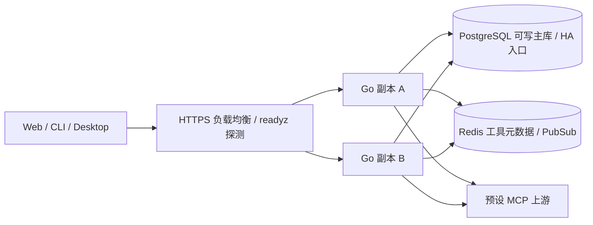

# ADR 0002：无粘性会话的多副本后端

日期：2026-09-10。用户要求所有后端支持分布式。继承模块化Go单体与PostgreSQL决策，通过水平扩容服务进程实现，不拆出无业务必要的微服务。

## 权威状态

| 模块 | 集群一致性机制 |
| --- | --- |
| 网页会话、令牌、用户停用 | 哈希存PG，每次鉴权读共享状态；注销和撤销不靠本机缓存 |
| OAuth、邮箱验证 | state/PKCE和验证令牌持久化，原子一次消费；首次身份创建与赠额有事务和provider锁 |
| 设备授权 | 发起、批准、轮询、消费均PG；轮询窗口与有效期由DB时钟决定 |
| 入口/令牌/用户限流 | rate_limits原子upsert，DB窗口只向前推进；换副本与重启不增加额度 |
| 钱包与账本 | 预占/结算/退款短事务与行锁；唯一键包含业务kind，跨业务不能相互占用幂等键 |
| 兑换码与团队 | 数据库事务、唯一消费与成员/钱包锁，席位和权限不依赖处理节点 |
| 工具配置 | tools事务触发单行revision递增；每次目录使用前比对DB版本，本地TTL仅控制远端发现缓存 |
| Redis | HTTP工具元数据短TTL共享与Pub/Sub失效通知；版本和授权仍读PG，故障直连发现 |
| 定时恢复 | 每个副本都可执行，DB时间确定过期，行锁和状态迁移保证只退款一次 |
| 迁移与管理员初始化 | 数据库advisory锁/约束，多个副本同时启动不重复初始化 |
| 报表 | DB时间生成统一UTC区间，索引查询使用明确起止参数 |

HTTP上游采用每副本每上游最多32个独占租用SDK会话，空闲会话与底层HTTP连接复用；不同上游独立，目录发现并发8。上游普通参数错误、断网或取消只能影响当前租用调用。配置退休后在用调用自然完成，全局关闭取消在用请求。连接、密码CPU槽、指标和本地缓存属于节点资源，不是集群业务权威。

## 运行边界

- 所有副本共享同一应用schema、公开Origin、加密密钥、OAuth/SMTP配置与兼容二进制。Web静态资源可由每副本提供，或统一部署CDN。不需要session affinity或共享本机文件目录。
- 数据库必须提供可写主库/高可用主库入口；资金、鉴权、撤销与配置版本不走延迟只读副本。应用扩容时按每实例20个DB连接与工作负载预算数据库容量。
- 共享业务配额是集群级；CPU槽、上游连接和发现并发是节点级，不能把它们误当成外部供应商的全局并发配额。stdio默认关闭；开启时所有可承接请求的副本须使用相同白名单与运行时；本地文件型上游状态不会因复制Go进程自动共享。
- 负载均衡按 `/readyz` 摘除未就绪副本，不粘会话；保留Host、Origin、Cookie、Authorization和流式响应，不自动重试POST/MCP工具调用。下线先摘流量再终止进程。
- 节点在外部调用途中消失时，不知道外部副作用是否发生；pending按规则恢复，绝不自动重放。OAuth已消费state后的执行中断需重新发起授权，不重用外部code。

## 验证范围

真实独立Go进程经标准库HTTP负载均衡交替接收请求，覆盖账号、MCP计费、团队幂等转入、设备批准/消费、节点关闭后继续访问、节点重新加入后的注销状态。两个独立连接池的OAuth、邮箱、限流、迁移、初始化、退款恢复与并发消费另有真实PG测试。Go原生synctest模拟节点时钟偏差，数据库保持真实时间。

这些证据证明应用多副本兼容性；本机使用单个PostgreSQL实例，未部署或演练实际数据库HA故障切换，也不等于公网负载均衡、跨地域一致性或灾备已经上线。生产数据库拓扑和基础设施由部署环境提供，不能从单机测试宣称完成集群运维。

## Redis缓存边界

用户明确追加Redis，使用Redis 8.10.1与官方go-redis v9.22.0；缓存可丢弃、不承载余额、会话、权限、账本或分布式锁。HTTP目录metadata共享5秒TTL，配置版本和配置摘要隔离缓存；stdio发现仍在节点内完成。Pub/Sub丢消息或重连不影响PG revision检查。

同部署各副本共享 `LOADOUT_REDIS_URL` 与 `LOADOUT_REDIS_NAMESPACE`；不同数据库/schema必须用不同namespace。Redis断开时有界超时后直接发现上游，`/readyz` 返回数据库就绪并附 `redis: degraded`，避免缓存故障同时摘除所有应用节点。Redis HA使用受保护的主入口或托管服务；当前客户端为单端点，不宣称支持Redis Cluster分片或Sentinel自动发现。

本地目录缓存与Redis元数据缓存各5秒TTL；上游自行改变工具定义、但未修改数据库配置时，两层叠加最多接近10秒才发现变化。数据库中的启用、定价和连接配置提交仍按revision立即失效，不受这两个TTL限制。

集群部署操作、静态资源混版本兼容、实际5秒Shutdown限制与完整变量契约见 [集群规范](../CLUSTER.md) 和 [环境参考](../ENVIRONMENT.md)。声明式模板只部署应用副本，PG/Redis HA和公网入口由平台提供。
